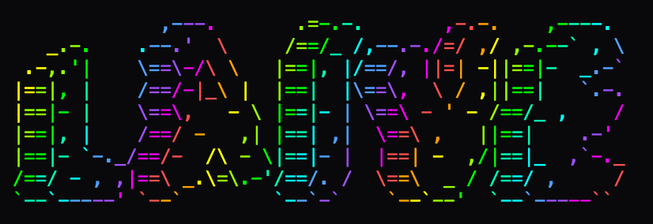

# laive



`laive` installs and runs a local Ableton Live control stack.

Today, the repo ships:

- a Python Remote Script scaffold for Ableton Live
- packaging and install tooling for macOS Live app bundles
- a staged Max for Live sidecar source project plus a shipped `.amxd` device
- a real MCP stdio server launch path that talks to the installed Live bridge
- a staged `laive-ui-helper.app` bundle for UI fallback permissions
- `.als` parsing scaffolds

## Proven MCP Capabilities

With Ableton Live running and the `laive` Control Surface enabled, the published MCP server can currently drive these workflows end-to-end:

- read the current project summary
- read the selected track, scene, clip, and device context
- list tracks
- read detailed track state, including session clips
- read a track's device tree and parameter state
- refresh the mirrored project state
- set song tempo
- start and stop transport
- create MIDI or audio tracks
- create scenes
- create MIDI clips in session slots
- rename Session clips
- move Session clips between slots
- change Session clip loop or length settings
- duplicate Session clips with explicit confirmation
- delete Session clips with explicit confirmation
- insert MIDI notes into clips
- replace a clip's note payload without appending
- launch Session View clips
- launch scenes
- stop clips on a target track or across the set
- browse Ableton browser roots and category paths through the control-surface bridge
- load browser items such as devices onto a target track through the control-surface browser API
- set device parameter values
- resolve device parameters by track/device/parameter name instead of only canonical IDs
- resolve quantized parameter modes by enum label when metadata is available
- report optional sidecar and UI-helper availability with setup guidance
- list and invoke optional sidecar workflows
- ensure the optional `laive-sidecar` device is present on a target MIDI track, preferring bridge-native browser loading and falling back to the UI helper when needed
- list and invoke optional UI-helper workflows

These capabilities have been validated against a live Ableton session through the published `laive-mcp` package, not just fixture mode.

The optional components are intentionally soft-failable:

- if the Max for Live sidecar is not installed or not active in the current set, the MCP tools return structured setup instructions for the agent to relay
- if the macOS UI helper is not installed or Accessibility is not granted, the MCP tools return setup instructions instead of silently failing

The bridge also reports lower-level support for subscriptions / event streaming, but that is not yet surfaced as a first-class MCP notification channel in the current release.
For debugging, the MCP server, JS bridge client, and Python Remote Script now write structured JSONL logs under `~/.local/share/laive/logs` by default. Set `LAIVE_LOG_DIR` if you want to redirect logs elsewhere.

Mixer control is now partially bridge-backed: `laive` can enumerate return/master tracks, read mixer metadata, set send levels, set monitor state, and update routing. The remaining `v0.6.0` gap is mainly breadth and real-session hardening, especially around return/master device workflows and edge-case routing semantics across supported Live versions.
Another current gap: Arrangement View and clip-envelope control are not yet first-class MCP workflows, so `laive` remains much stronger in Session View than in arrangement editing today.

The current roadmap is intentionally sliced into concrete follow-up releases:

- `v0.6.0`: mixer/routing coverage including return/master tracks and sends
- `v0.7.0`: Arrangement View support
- `v0.8.0`: clip envelopes and deeper sidecar workflows

If you are using this as an end user, the published npm entrypoint is `laive-mcp`. The Ableton-side control surface name remains `laive`.

## Control Surface Vs Sidecar

`laive` has two different Ableton-facing roles:

- The Python Remote Script control surface is the primary bridge. It handles global set reads, clip or scene creation, note editing, Session View launch or stop, browser-backed device loading, and parameter control.
- The Max for Live sidecar is optional. It is for selection-aware, track-local, or future analysis-heavy workflows that are easier from inside the Live set than from the app-level bridge.

In practice, agents should prefer the control-surface path first. The sidecar is a complementary helper for:

- selected-context snapshots
- selected-device observation
- future selected-clip transforms
- future parameter snapshot or restore workflows
- future clip-envelope inspection
- future lightweight analysis on the loaded track

## Published Package

After publish, the intended end-user interface is:

```sh
npx laive-mcp doctor
npx laive-mcp detect --json
npx laive-mcp install --apply
npx laive-mcp mcp-config --json --published
npx laive-mcp mcp
```

## From Source

If you are running from a local clone instead of npm, use:

```sh
node ./bin/laive.mjs doctor
node ./bin/laive.mjs detect --json
node ./bin/laive.mjs install --apply
node ./bin/laive.mjs mcp
```

## Prerequisites

- macOS
- Node 18.16 or newer
- `python3` on `PATH` for `laive doctor`, `laive detect`, `laive package`, and `laive install`

## What Remains Manual

The installer does not and should not automate:

1. opening Ableton Live
2. enabling `laive` in Live's `Control Surface` preferences
3. launching `laive mcp` from your MCP client configuration
4. granting macOS Accessibility permissions to the installed `laive-ui-helper.app` if you want UI fallback features
5. loading the installed `laive-sidecar.amxd` onto a MIDI track if you want optional sidecar features and are not using the MCP placement workflow

## What The Installer Automates

The installer currently automates everything in the repo that can be automated safely:

- verifies the Remote Script source exists
- detects likely Ableton Live app bundles in `/Applications` and `~/Applications`
- packages the Python Remote Script into `artifacts/remote-script`
- stages the Max for Live sidecar source project into `artifacts/live-sidecar-m4l`
- stages the Max for Live sidecar `.amxd` into `artifacts/live-sidecar-m4l`
- stages the UI helper app into `artifacts/ui-helper`
- resolves the correct `MIDI Remote Scripts` destination inside the chosen Live app
- installs the `laive` Remote Script into that destination
- installs the UI helper app into the default target `~/Applications/laive-ui-helper.app`
- installs the shipped `laive-sidecar.amxd` into the default Ableton User Library MIDI Effect path

The sidecar installer currently targets the default Ableton User Library path under `~/Music/Ableton/User Library/...`. It does not detect a custom User Library location configured inside Live.

Install runs are dry-run by default. `--apply` performs the copy.

## End-User Install Flow

### 1. Run A Readiness Check

```sh
node ./bin/laive.mjs doctor
```

### 2. Detect Live Installs

```sh
node ./bin/laive.mjs detect --json
```

### 3. Install The Remote Script

If you only have one Live install detected, this is enough:

```sh
node ./bin/laive.mjs install --apply
```

If you want to target a specific app bundle, pass its actual `.app` path. The path below is only an example:

```sh
node ./bin/laive.mjs install --live-app "/Applications/Ableton Live 12 Suite.app" --apply
```

Preview first without writing anything:

```sh
node ./bin/laive.mjs install --json
node ./bin/laive.mjs install --live-app "/Applications/Ableton Live 12 Suite.app" --json
```

### 4. Open Live And Enable The Script

After install:

1. Open Ableton Live.
2. Open `Settings` or `Preferences`.
3. Go to `Link, Tempo & MIDI`.
4. In a `Control Surface` slot, choose `laive`.
5. Leave the input/output ports unset unless your later setup requires them.

### 5. Load The Optional Max For Live Sidecar

`laive install` also stages the Max for Live sidecar source project automatically.

The staged project is here:

```text
artifacts/live-sidecar-m4l/laive-sidecar
```

Preferred end-user path:

1. Use the installed device at the default target `~/Music/Ableton/User Library/Presets/MIDI Effects/Max MIDI Effect/laive-sidecar.amxd`.
2. In Ableton Live, drag that `.amxd` onto a MIDI track in the device chain if you want the manual path.
3. Prefer the MCP tool `ensure_sidecar_on_track` so the agent can select the target track and try bridge-native browser loading first, then fall back to the UI helper if Live's browser model does not expose the sidecar directly.
4. Use the sidecar only after the base Remote Script is already working.
5. If your Live setup uses a custom User Library location, move or copy the installed `.amxd` from the default path into that configured library manually after install.

Developer/source path:

1. Open `artifacts/live-sidecar-m4l/laive-sidecar/laive-sidecar.maxproj` in Max if you want the full project view.
2. Open `artifacts/live-sidecar-m4l/laive-sidecar/patchers/laive-sidecar.maxpat` directly if you only want the patcher.
3. Confirm the `node.script` object points at `../code/laive-sidecar-node.js`.
4. The source patcher now ships with bundled branding assets under `project/assets/` and uses a `jsui` renderer for the in-Live device UI, drawing `logo.png` first with a built-in ASCII fallback if the image cannot be loaded.

### 6. Start The MCP Server For Agents

Once Live is open and the `laive` Control Surface is enabled, launch the MCP server:

```sh
node ./bin/laive.mjs mcp
```

You can also point it at a specific bridge host/port:

```sh
node ./bin/laive.mjs mcp --host 127.0.0.1 --port 7612
```

If you want a local smoke test without Ableton, use fixture mode:

```sh
node ./bin/laive.mjs mcp --fixture
```

Generic MCP client command config from a local clone:

```json
{
  "command": "node",
  "args": ["/absolute/path/to/laive/bin/laive.mjs", "mcp"]
}
```

You can also print both local and published MCP launch definitions from the CLI:

```sh
node ./bin/laive.mjs mcp-config --json
```

### 7. Optional UI Fallback

The macOS UI fallback logic lives in [packages/ui-automation](./packages/ui-automation). It is not required for the initial Remote Script install.

If you want to use it, grant Accessibility permission to the installed helper app:

```text
~/Applications/laive-ui-helper.app
```

## Commands

- `node ./bin/laive.mjs doctor`
  - report whether the repo is ready to install
- `node ./bin/laive.mjs detect [--json]`
  - detect likely local Live app bundles
- `node ./bin/laive.mjs package`
  - package the Remote Script, stage the Max for Live sidecar project, and stage the UI helper app
- `node ./bin/laive.mjs install [--live-app PATH] [--apply] [--overwrite] [--json]`
  - package the Remote Script, stage the sidecar project and UI helper, and install the Remote Script into a Live app bundle
- `node ./bin/laive.mjs mcp [--host HOST] [--port PORT] [--fixture]`
  - launch the MCP stdio server for agent clients
- `node ./bin/laive.mjs mcp-config [--json] [--local|--published]`
  - print MCP client launch config for local-dev or published package use
- `node ./bin/laive.mjs package-ui-helper`
  - stage the `laive-ui-helper.app` bundle for Accessibility permissions

If `laive` does not appear in Live's `Control Surface` list after install, restart Live and rerun `node ./bin/laive.mjs install --json` or `npx laive-mcp install --json` to confirm the target app bundle and `MIDI Remote Scripts` path.
If the MCP server or bridge drops after a period of inactivity, inspect `~/.local/share/laive/logs/mcp-server.jsonl`, `~/.local/share/laive/logs/bridge-client.jsonl`, and `~/.local/share/laive/logs/remote-script.jsonl` before restarting everything; the lazy bridge session now reconnects automatically after socket close, so the logs should make it obvious whether the failure is in the MCP process or the Live-side bridge.

## Sidecar Role

The Python Remote Script remains the primary integration surface. It already covers:

- project and selection reads
- clip, scene, and track creation
- note insert and replace
- Session View launch and stop
- browser-backed device loading
- parameter control

The Max for Live sidecar is for workflows that are better from inside the set:

- selection-aware context snapshots
- selected-device parameter observation
- track-local or selected-clip transforms
- future parameter snapshot or restore workflows
- future clip-envelope editing
- future lightweight analysis workflows

If the sidecar is not active, the MCP server should still remain useful and return setup guidance instead of failing blindly.

## Verification

Development verification commands:

```sh
npm test
npm run test:python
python3 -m unittest ./scripts/remote_script_tooling_test.py
```

## More Docs

- [docs/quickstart.md](./docs/quickstart.md)
- [docs/operator-checklist-macos.md](./docs/operator-checklist-macos.md)
- [docs/release-process.md](./docs/release-process.md)
- [docs/troubleshooting.md](./docs/troubleshooting.md)
- [docs/compatibility-matrix.md](./docs/compatibility-matrix.md)
